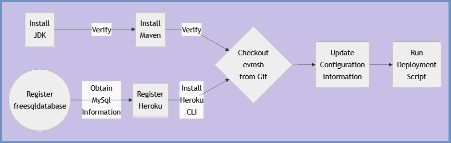

# Deploy SpringBoot Java MySQL Secured Web App on Heroku Tutorial
## Workflow

## References
<ul>
 <li><a href="https://jdk.java.net/17/">Open JDK 17</a></li>
  <li><a href="https://maven.apache.org/">Apache Maven</a></li>
  <li><a href="https://www.freesqldatabase.com/">Free MySQL Database</a></li>
  <li><a href="https://www.heroku.com/">Heroku</a></li>
  <li><a href="https://devcenter.heroku.com/articles/heroku-cli#download-and-install">Heroku CLI</a></li>
  <li><a href="https://www.youtube.com/watch?v=SY50wbkuoS8&list=PL5pIDFWFLqx1_4s3uPdcD-ONBDAOWVmlP">COVID19 Employee Vaccine Management System Java SQL Tutorial Series (10 Videos)</a></li>
</ul>

## Tutorial

